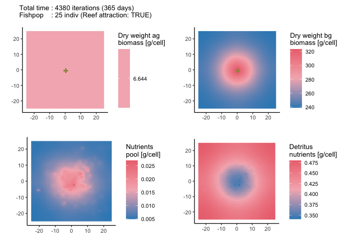

<!-- README.md is generated from README.Rmd. Please edit that file -->

# *arrR*

<!-- badges: start -->

[](https://www.repostatus.org/#active)
[](https://www.tidyverse.org/lifecycle/#maturing)

[](https://github.com/Allgeier-Lab/arrR/actions)

[](https://opensource.org/licenses/MIT)

<!-- badges: end -->

    #> Test coverage (local): 81.78 %

The goal of *arrR* is to simulate seagrass growth around artificial
reefs.

## Installation

You can install *arrR* from
[GitHub](https://github.com/Allgeier-Lab/arrR) with the following line
of code. You will need the `auth_token` because the repository is
currently set to private so only members of the Allgeier Lab can see it.
**PLEASE DON’T SHARE THIS TOKEN WITH ANYONE WITHOUT LETTING ME KNOW
FIRST**.

``` r
remotes::install_github(repo = "Allgeier-Lab/arrR",  ref = "development",
                        auth_token = "e46c8683663fd7a14869c949a48582063e64b915")
```

<!-- Add CRAN link if applicable -->

## Example

To access all functions to run the mode, simply load the library.

``` r
library(arrR)
```

The starting values and parameters must be imported as two separated
list with a named object for each value. There is a function to import
these values and automatically convert them to a list
(`read_parameters`). The files must be a table with two columns. The
first column must be called “parameter” and include a string of all
parameter names. The second column must the called “value” and include
the actual values.

To check if all parameters are available, use `check_parameters`.

``` r
starting_values <- arrR::default_starting_values

parameters <- arrR::default_parameters

check_parameters(starting_values = starting_values, parameters = parameters)
#> > ...Checking starting values...
#> > ...Checking parameter values...
#> > ...Checking if starting values are within parameter boundaries...
#> 
#> > All checking done!
```

To setup the simulation seafloor and individuals, simply run
`setup_seafloor` and `setup_population`. If you want to add artificial
reefs to the seafloor, provide a `matrix` with x,y coordinates of all AR
cells.

``` r
reef_matrix <- matrix(data = c(-1, 0, 0, 1, 1, 0, 0, -1, 0, 0), 
                      ncol = 2, byrow = TRUE)

input_seafloor <- setup_seafloor(extent = c(50, 50), grain = 1, 
                                 reefs = reef_matrix, 
                                 starting_values = starting_values)
#> > ...Creating seafloor with extent(50, 50)...
#> > ...Creating 5 artifical reef cells...

input_fishpop <- setup_fishpop(seafloor = input_seafloor, 
                               starting_values = starting_values, 
                               parameters = parameters)
#> > ...Creating 25 individuals within extent(-25, 25, -25, 25)...
```

To run a simulation, simply provide the previously created seafloor and
population as well as all parameters to the `run_simulation` function.
Additionally, you need to specify the number of timesteps that are
simulated.

``` r
min_per_i <- 120

# run the model for three years
max_i <- (60 * 24 * 365 * 1) / min_per_i

result <- run_simulation(seafloor = input_seafloor, 
                         fishpop = input_fishpop,
                         parameters = parameters, 
                         reef_attraction = TRUE,
                         max_i = max_i, min_per_i = min_per_i)

result
#> Total time : 4380 iterations (365 days) [Burn-in: 0 iter.]
#> Saved each : 1 iterations (0.08 days)
#> Seafloor   : extent(-25, 25, -25, 25), 5 reef cells
#> Fishpop    : 25 indiv (reef_attraction: TRUE)
#> 
#> Seafloor : (ag_biomass, bg_biomass, nutrients_pool, detritus_pool, detritus_dead)
#> Minimum  : 6.644, 238.891, 0.005, 0.341, 0
#> Mean     : 6.644, 254.575, 0.009, 0.439, 0
#> Maximum  : 6.644, 323.486, 0.027, 0.48, 0
#> 
#> Fishpop  : (length, weight, died_consumption, died_background)
#> Minimum  : 12.112, 32.121, 0, 0
#> Mean     : 16.283, 90.523, 0, 0
#> Maximum  : 21.81, 206.191, 0, 0
```

To plot the results, pass the resulting object to the `plot` function.
This will automatically create a plot of the selected timestep (default:
last timestep). Plotting methods are available for both the seafloor and
the fish population using the `what` argument.

``` r
plot(result, what = "seafloor")
```



### Code of Conduct

Please note that the *arrR* project is released with a [Contributor Code
of
Conduct](https://contributor-covenant.org/version/2/0/CODE_OF_CONDUCT.html).
By contributing to this project, you agree to abide by its terms.
