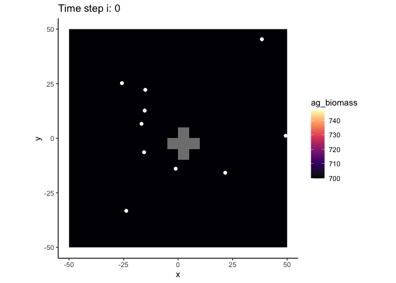

<!-- README.md is generated from README.Rmd. Please edit that file -->

# coRal

<!-- badges: start -->

<!-- badges: end -->

The goal of coRal is to …

## Installation

You can install coRal from
[GitHub](https://github.com/Allgeier-Lab/coRal) with:

``` r
remotes::install_github("Allgeier-Lab/coRAL")
```

<!-- Add CRAN link if applicable -->

## Example

To access all functions to run the mode, simply load the library.

``` r
library(coRal)
```

The starting values and parameters must be imported as two separated
list with a named object for each value. There is a function to import
these values and automatically convert them to a list
(`read_parameters`). The files must be a table with two columns. The
first column must be called “parameter” and include a string of all
parameter names. The second column must the called “value” and include
the actual values.

To check if all parameters are available, use `check_parameters`.

``` r
starting_values <- system.file("extdata", "starting_values.csv", package = "coRal")
parameters <- system.file("extdata", "parameters.csv", package = "coRal")

starting_values <- read_parameters(file = starting_values, sep = ";")
parameters <- read_parameters(file = parameters, sep = ";")

check_parameters(starting_values = starting_values, parameters = parameters)
#> All starting values and parameters are available...
```

To setup the simulation environment and individuals, simply run
`setup_environment` and `setup_population`. If you want to add
artificial reefs to the environment, provide a `matrix` with x,y
coordinates of all AR cells.

``` r
reef_matrix <- matrix(data = c(-1, 0, 0, 1, 1, 0, 0, -1, 0, 0), 
                      ncol = 2, byrow = TRUE) * 5

input_environment <- setup_environment(extent = c(100, 100), grain = 5, reefs = reef_matrix, 
                                       starting_values = starting_values, parameters = parameters)
#> Creating environment with extent(100, 100)...
#> Creating 5 artifical reef cells...

input_population <- setup_population(environment = input_environment, 
                                     starting_values = starting_values, parameters = parameters)
#> Creating 10 individuals within extent(-50, 50, -50, 50)...
```

To rum a simulation, simply provide the previously created environment
and population as well as all parameters and starting values the
`run_simulation` function. Additionally, you need to specify the number
of time steps that are simulated.

``` r
result <- run_simulation(environment = input_environment, population = input_population, 
                         starting_values = starting_values, parameters = parameters, 
                         max_i = 50, verbose = FALSE)
```

The animate the results, pass the resulting object to `animate_result`.
This will produce a GIF, but you need the packages `ggplot2`,
`gganimate` and `gifski`.

``` r

animate_result(result, fill = "ag_biomass", end_pause = 10, duration = 30)
```



### Code of Conduct

Please note that the coRal project is released with a [Contributor Code
of
Conduct](https://contributor-covenant.org/version/2/0/CODE_OF_CONDUCT.html).
By contributing to this project, you agree to abide by its terms.
