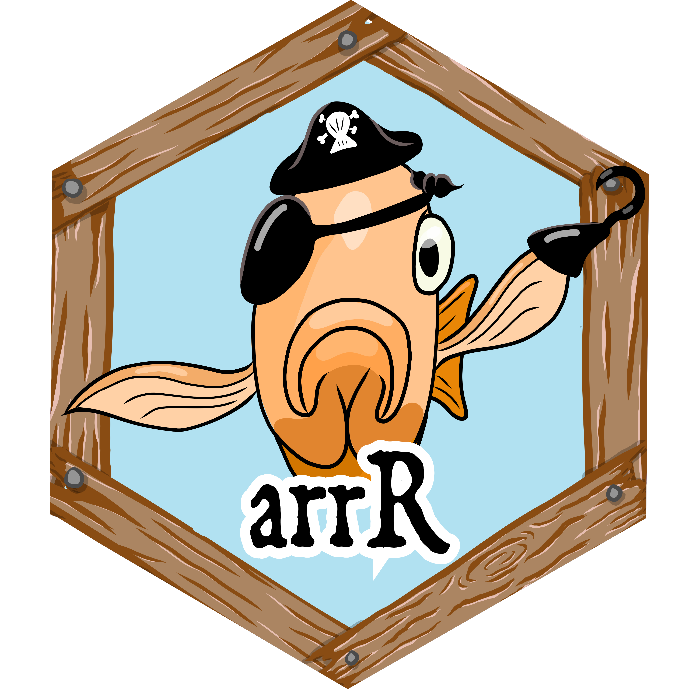
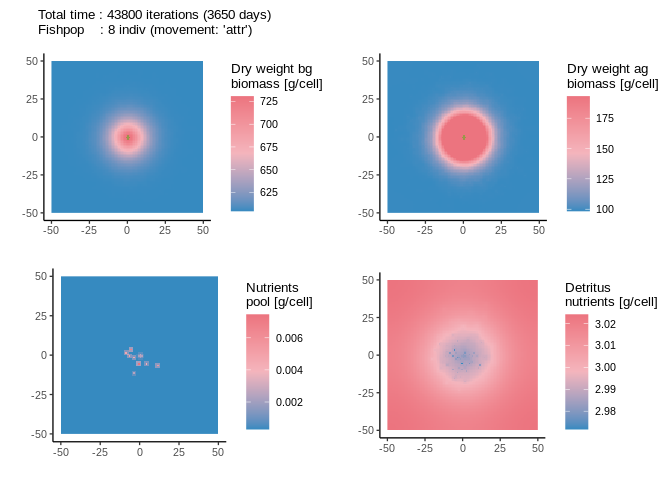

<!-- README.md is generated from README.Rmd. Please edit that file -->

# **arrR** | **Ar**tifical **r**eefs in **R** 

<!-- badges: start -->

| Development                                                                                                                        | CI                                                                                                                                                                           | License                                                                                                         |
| ---------------------------------------------------------------------------------------------------------------------------------- | ---------------------------------------------------------------------------------------------------------------------------------------------------------------------------- | --------------------------------------------------------------------------------------------------------------- |
| [](https://www.repostatus.org/#active)                       | [](https://github.com/Allgeier-Lab/arrR/actions/workflows/R-CMD-check.yaml) | [](https://www.gnu.org/licenses/gpl-3.0) |
| [](https://www.tidyverse.org/lifecycle/#stable) | [](https://codecov.io/gh/Allgeier-Lab/arrR)                           |                                                                                                                 |

<!-- badges: end -->

The goal of **arrR** is to simulate seagrass primary production around
artificial reefs (ARs). For a more detailed model description, please
see `vignette("general-background")`. Please see
`vignette("get-started")` for a short tutorial how to use **arrR**.

## Citation

To cite *arrR* in a publication or acknowledge its use, please use the
following temporary citation information, substituting ‘v0.0’ with the
version of the package that you used:

> *Esquivel, K.E., Hesselbarth, M.H.K., Allgeier, J.E. Mechanistic
> support for increased primary production around artificial reefs.
> Manuscript submitted for publication. v0.0*

For more information, please see `vignette("publication-record")`. To
get a BibTex entry, please use `citation("arrR")`.

## Installation

You can install **arrR** from
[GitHub](https://github.com/Allgeier-Lab/arrR) with the following line
of code. If you want to install the most recent development version,
please specify the argument `ref = "development"` within the function.

``` r
remotes::install_github(repo = "Allgeier-Lab/arrR", ref = "main")
```

## Get started

Please see `vignette("get-started")` for a short tutorial how to use the
**arrR** package.



## Code of Conduct

Please note that the **arrR** package is released with a [Contributor
Code of
Conduct](https://contributor-covenant.org/version/2/0/CODE_OF_CONDUCT.html).
By contributing to this project, you agree to abide by its terms.

### Contact

Questions or bugs? Please get in touch via
[mhk.hesselbarth\<at\>gmail.com](mailto:mhk.hesselbarth@gmail.com) or
submit an issue [here](https://github.com/Allgeier-Lab/arrR/issues). We
are always happy to hear your input\!
